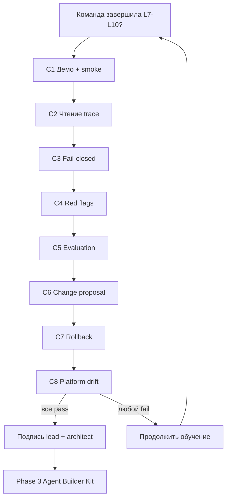

# Готовность к Phase 3

```mermaid
flowchart TD
    START[Команда завершила L7-L10?]
    C1[C1 Демо + smoke]
    C2[C2 Чтение trace]
    C3[C3 Fail-closed]
    C4[C4 Red flags]
    C5[C5 Evaluation]
    C6[C6 Change proposal]
    C7[C7 Rollback]
    C8[C8 Platform drift]
    SIGN[Подпись lead + architect]
    P3[Phase 3 Agent Builder Kit]
    TRAIN[Продолжить обучение]
    START --> C1 --> C2 --> C3 --> C4 --> C5 --> C6 --> C7 --> C8
    C8 -->|все pass| SIGN --> P3
    C8 -->|любой fail| TRAIN
    TRAIN --> START
```

Политика: [../governance/phase-3-gate-policy.md](../governance/phase-3-gate-policy.md)
