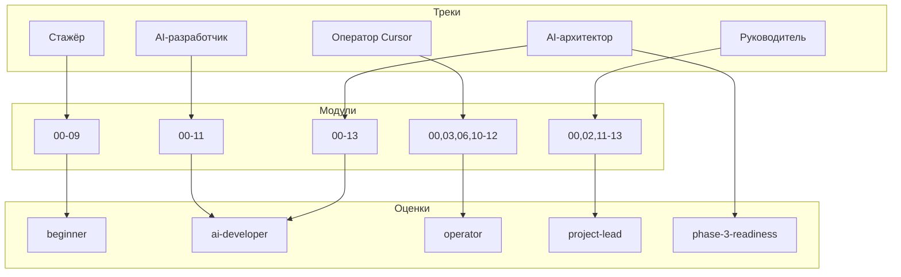

# Треки по ролям

```mermaid
flowchart TB
    subgraph tracks [Треки]
        I[Стажёр]
        D[AI-разработчик]
        O[Оператор Cursor]
        L[Руководитель]
        A[AI-архитектор]
    end
    subgraph mods [Модули]
        M0[00-09]
        Mfull[00-11]
        Mop[00,03,06,10-12]
        Mlead[00,02,11-13]
        Mall[00-13]
    end
    subgraph assess [Оценки]
        B[beginner]
        AD[ai-developer]
        OP[operator]
        PL[project-lead]
        P3[phase-3-readiness]
    end
    I --> M0 --> B
    D --> Mfull --> AD
    O --> Mop --> OP
    L --> Mlead --> PL
    A --> Mall --> AD
    A --> P3
```
