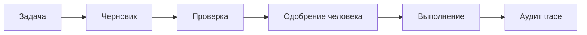
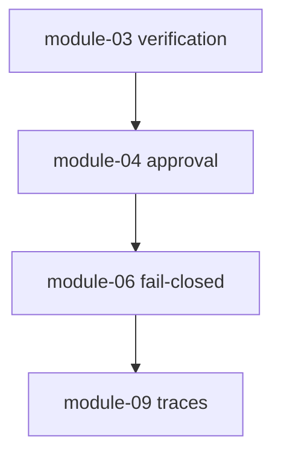

# Безопасный AI-workflow (учебный порядок)

```mermaid
flowchart LR
    T[Задача]
    D[Черновик]
    V[Проверка]
    A[Одобрение человека]
    E[Выполнение]
    AU[Аудит trace]
    T --> D --> V --> A --> E --> AU
```

Модули по порядку преподавания: 03 → 04 → 06 → 09.

```mermaid
flowchart TB
    M03[module-03 verification]
    M04[module-04 approval]
    M06[module-06 fail-closed]
    M09[module-09 traces]
    M03 --> M04 --> M06 --> M09
```
