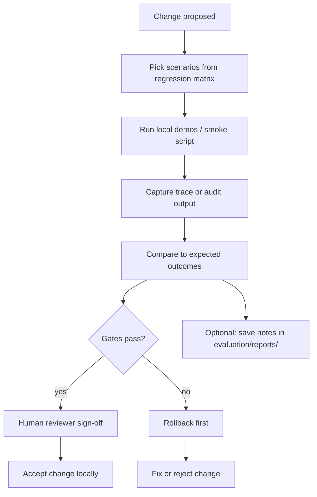

# Evaluation Loop

```mermaid
flowchart TD
    A[Change proposed] --> B[Pick scenarios from regression matrix]
    B --> C[Run local demos / smoke script]
    C --> D[Capture trace or audit output]
    D --> E[Compare to expected outcomes]
    E --> F{Gates pass?}
    F -->|yes| G[Human reviewer sign-off]
    F -->|no| H[Rollback first]
    H --> I[Fix or reject change]
    G --> J[Accept change locally]
    E --> K[Optional: save notes in evaluation/reports/]
```

Local loop only — no CI trigger, no automated merge gate.
