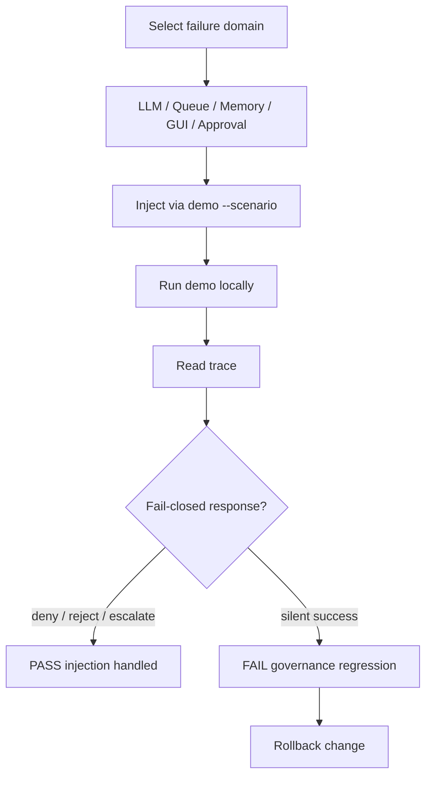

# Failure Injection

```mermaid
flowchart TD
    S[Select failure domain] --> L[LLM / Queue / Memory / GUI / Approval]
    L --> I[Inject via demo --scenario]
    I --> R[Run demo locally]
    R --> T[Read trace]
    T --> F{Fail-closed response?}
    F -->|deny / reject / escalate| P[PASS injection handled]
    F -->|silent success| X[FAIL governance regression]
    X --> RB[Rollback change]
```

Intentional failures teach safe behavior — not chaos platform.
