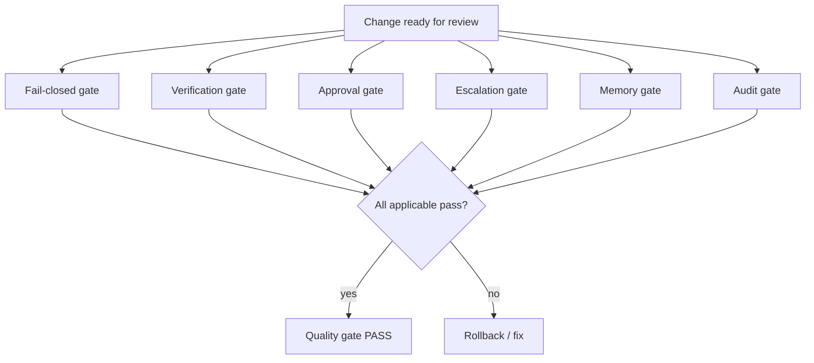

# Quality Gates Diagram

```mermaid
flowchart TD
    Q[Change ready for review] --> FC[Fail-closed gate]
    Q --> VR[Verification gate]
    Q --> AP[Approval gate]
    Q --> ES[Escalation gate]
    Q --> ME[Memory gate]
    Q --> AU[Audit gate]
    FC --> M{All applicable pass?}
    VR --> M
    AP --> M
    ES --> M
    ME --> M
    AU --> M
    M -->|yes| OK[Quality gate PASS]
    M -->|no| RB[Rollback / fix]
```

Gates are checklists + scenarios — not runtime middleware.
