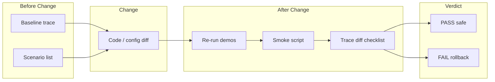

# Regression Check Flow

```mermaid
flowchart LR
    subgraph before [Before Change]
        B1[Baseline trace]
        B2[Scenario list]
    end
    subgraph change [Change]
        C1[Code / config diff]
    end
    subgraph after [After Change]
        A1[Re-run demos]
        A2[Smoke script]
        A3[Trace diff checklist]
    end
    subgraph verdict [Verdict]
        V1[PASS safe]
        V2[FAIL rollback]
    end
    B1 --> C1
    B2 --> C1
    C1 --> A1
    A1 --> A2
    A2 --> A3
    A3 --> V1
    A3 --> V2
```

Human compares traces — no automated diff engine in Phase 2.5.
