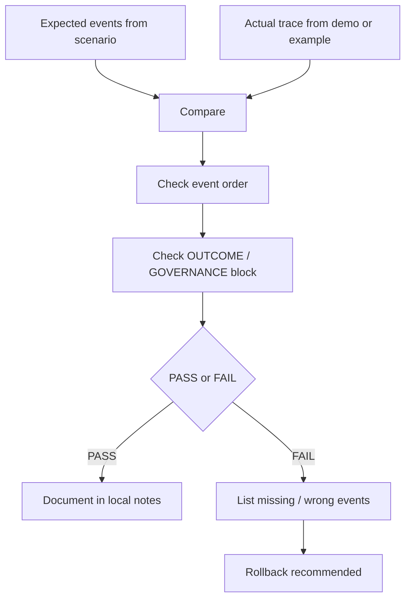

# Trace Comparison

```mermaid
flowchart TD
    E[Expected events from scenario] --> C[Compare]
    A[Actual trace from demo or example] --> C
    C --> O[Check event order]
    O --> G[Check OUTCOME / GOVERNANCE block]
    G --> P{PASS or FAIL}
    P -->|PASS| N[Document in local notes]
    P -->|FAIL| R[List missing / wrong events]
    R --> RB[Rollback recommended]
```

Reference: `trace-comparison/trace-comparison-rules.md`
