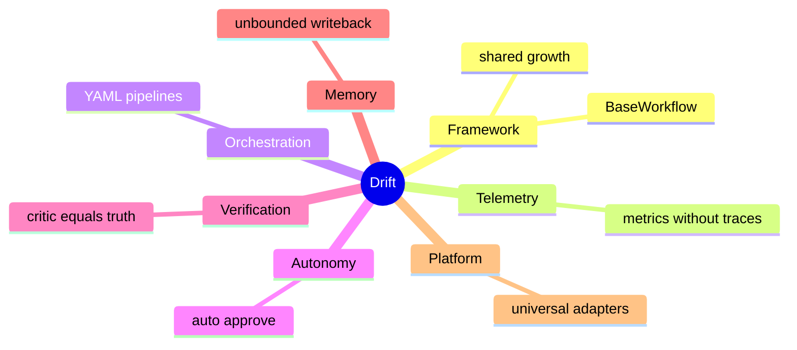

# Architecture Drift

```mermaid
mindmap
  root((Drift))
    Framework
      BaseWorkflow
      shared growth
    Telemetry
      metrics without traces
    Orchestration
      YAML pipelines
    Autonomy
      auto approve
    Verification
      critic equals truth
    Memory
      unbounded writeback
    Platform
      universal adapters
```

Detect via [early-warning-signals.md](../drift-detection/early-warning-signals.md).
