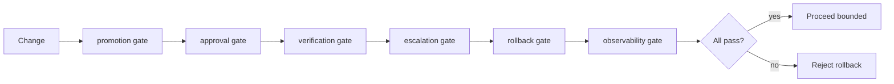

# Governance Gates (Change)

```mermaid
flowchart LR
    CHG[Change] --> PG[promotion gate]
    PG --> AG[approval gate]
    AG --> VG[verification gate]
    VG --> EG[escalation gate]
    EG --> RG[rollback gate]
    RG --> OG[observability gate]
    OG --> GO{All pass?}
    GO -->|yes| SHIP[Proceed bounded]
    GO -->|no| BLOCK[Reject rollback]
```

Checklists: [gate-checklists.md](../governance-gates/gate-checklists.md)
