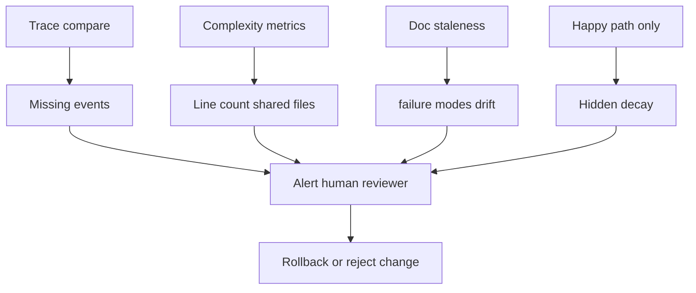

# Regression Detection

```mermaid
flowchart TD
    H[Happy path only] --> HD[Hidden decay]
    T[Trace compare] --> EV[Missing events]
    C[Complexity metrics] --> CC[Line count shared files]
    D[Doc staleness] --> DR[failure modes drift]
    EV --> AL[Alert human reviewer]
    CC --> AL
    DR --> AL
    HD --> AL
    AL --> RP[Rollback or reject change]
```

Human-readable detection — not automated regression SaaS.
