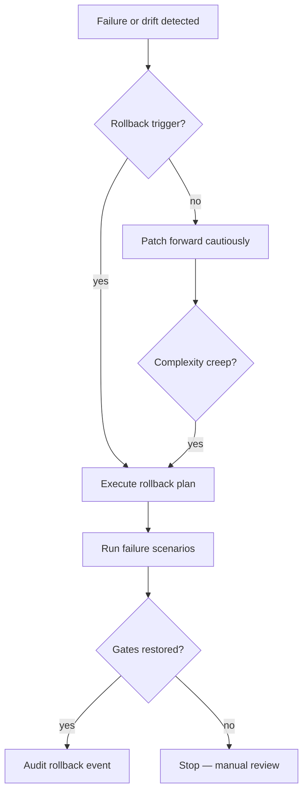

# Rollback Flow

```mermaid
flowchart TD
    F[Failure or drift detected] --> T{Rollback trigger?}
    T -->|no| P[Patch forward cautiously]
    T -->|yes| RB[Execute rollback plan]
    RB --> V[Run failure scenarios]
    V --> OK{Gates restored?}
    OK -->|yes| AUD[Audit rollback event]
    OK -->|no| STOP[Stop — manual review]
    P --> D{Complexity creep?}
    D -->|yes| RB
```

Fail closed during rollback — mock/deny modes default.
