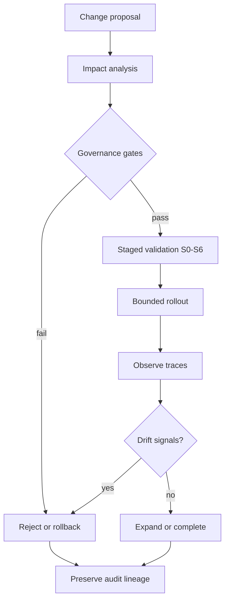

# Safe Evolution Lifecycle

```mermaid
flowchart TD
    P[Change proposal] --> I[Impact analysis]
    I --> G{Governance gates}
    G -->|fail| R[Reject or rollback]
    G -->|pass| S[Staged validation S0-S6]
    S --> B[Bounded rollout]
    B --> O[Observe traces]
    O --> D{Drift signals?}
    D -->|yes| R
    D -->|no| E[Expand or complete]
    R --> A[Preserve audit lineage]
    E --> A
```

Conceptual only — no CI/CD engine.
