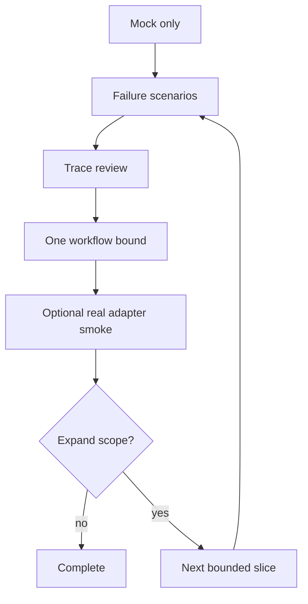

# Safe Rollout (Conceptual)

```mermaid
flowchart TD
    M[Mock only] --> F[Failure scenarios]
    F --> T[Trace review]
    T --> ONE[One workflow bound]
    ONE --> AD[Optional real adapter smoke]
    AD --> EXP{Expand scope?}
    EXP -->|no| DONE[Complete]
    EXP -->|yes| M2[Next bounded slice]
    M2 --> F
```

No Kubernetes canary — human-staged validation.
