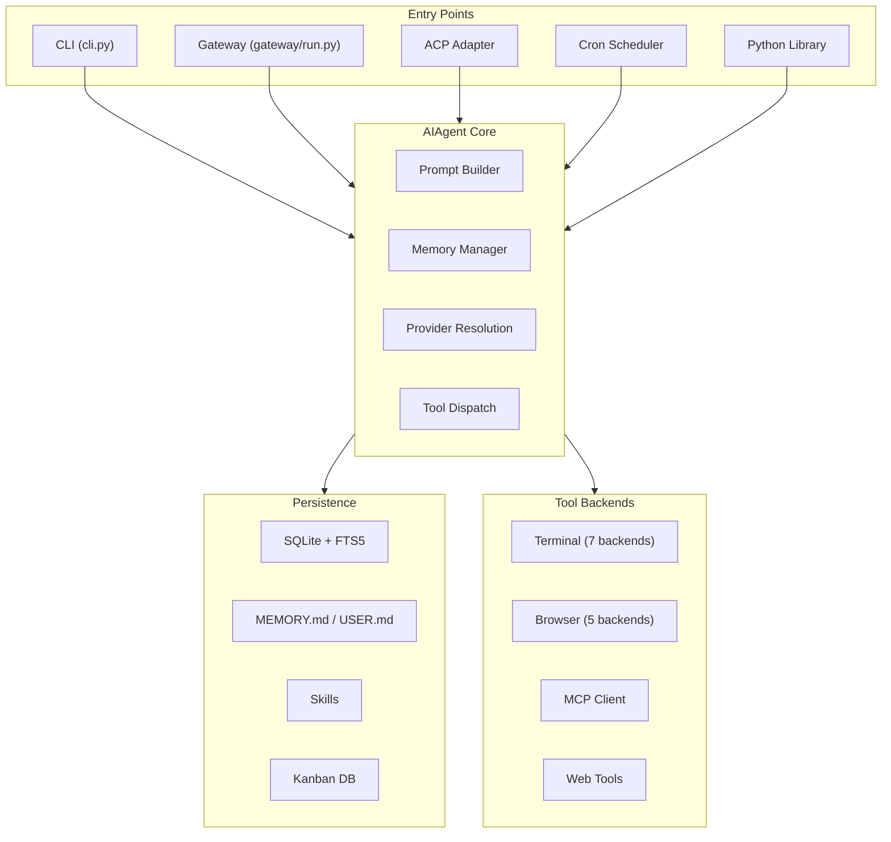
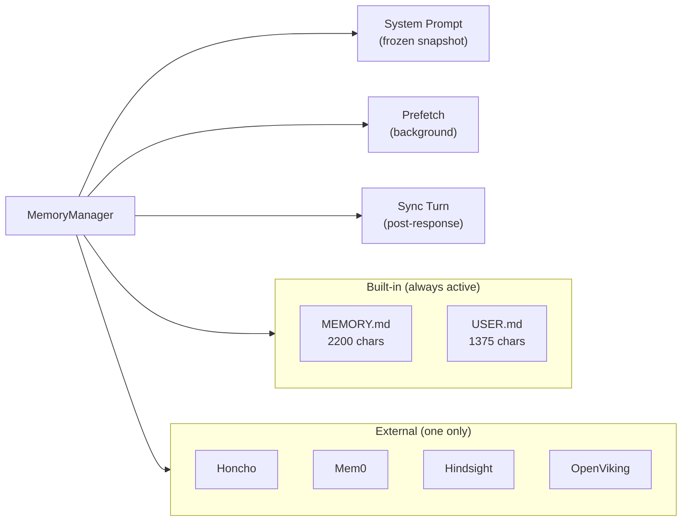
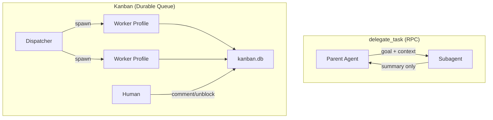
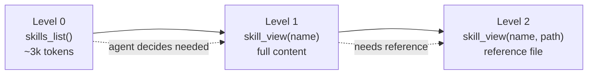
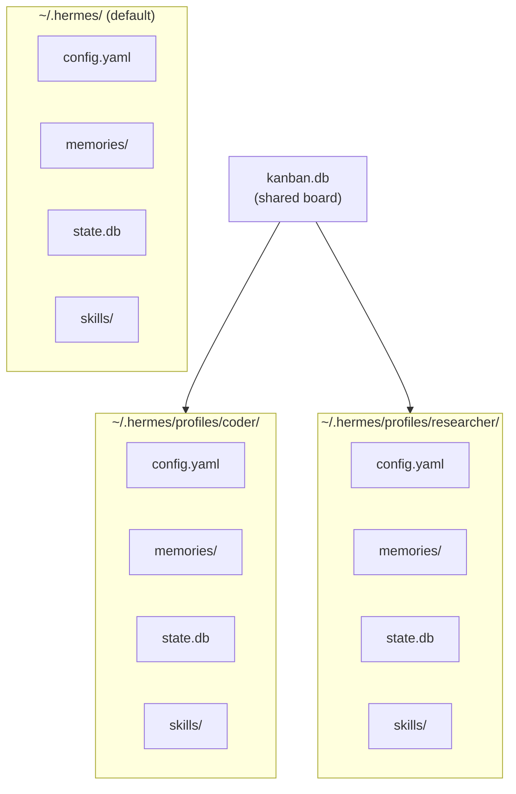
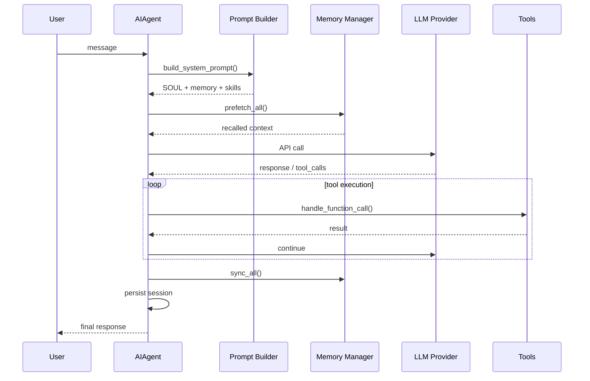
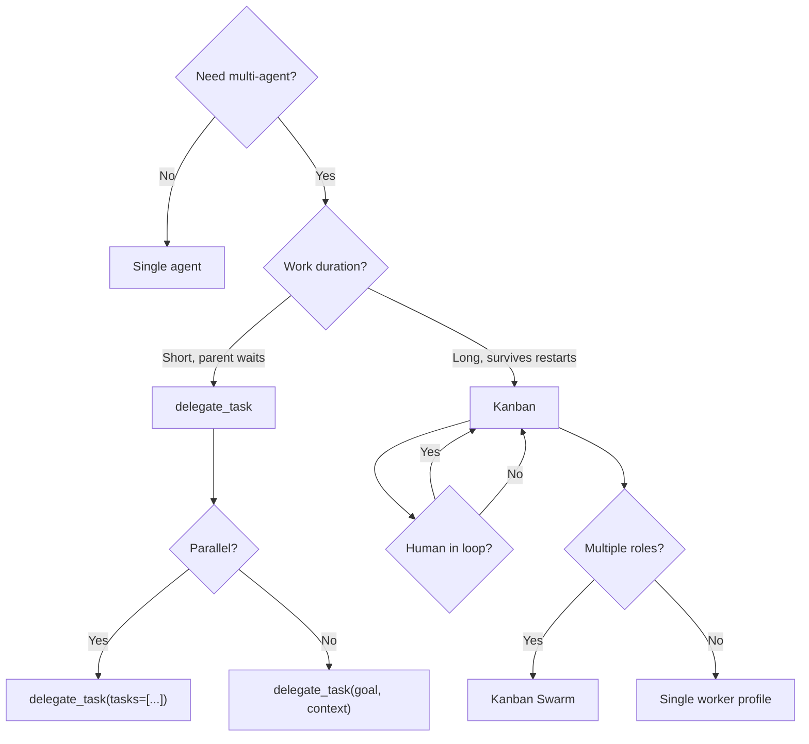
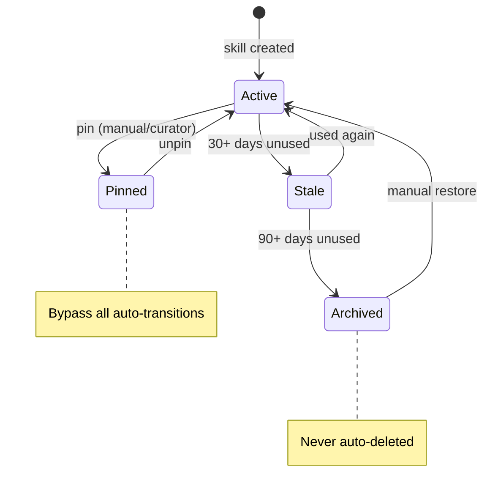

# Architecture Diagrams

Mermaid diagrams for Hermes Agent architecture understanding.

---

## System Overview

---

## Memory System

---

## Multi-Agent Models

---

## Skill Progressive Disclosure

---

## Profile Isolation

---

## Agent Loop Sequence

---

## Kanban vs Delegate Decision

---

## Curator Lifecycle

