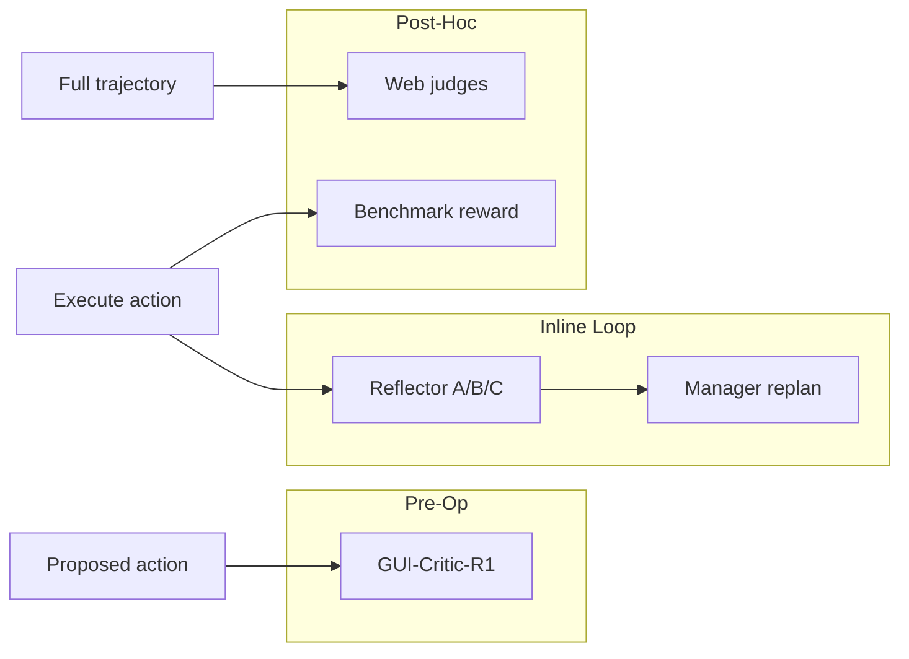

# Action Verification

Механизмы проверки, что действие достигло intended UI state.

---

## Post-Action Reflection (v2, v3, PC, MA-E)

### Outcome taxonomy

| Code | Meaning | Typical response |
|------|---------|------------------|
| **A** | Success — UI changed as expected | Continue plan |
| **B** | Wrong page / unexpected navigation | Back + error_flag |
| **C** | No visible change | Retry + error_flag |

### v2 implementation

- `get_reflect_prompt()` — dual screenshots + dual perception lists
- Separate LLM call after each action (if `reflection_switch` True)
- Sets `error_flag` for next action prompt

### v3 ActionReflector class

- Uses InfoPool action history + before/after screenshots
- Updates `action_outcomes`, `error_descriptions`
- Contributes to `error_flag_plan` counter for Manager replan

---

## Pre-Action Critic (GUI-Critic-R1)

**Different timing:** diagnose **before** executing step.

- `test.py` → `critic_inference()` with Qwen2.5-VL
- System role: "helpful critic agent for GUI operation"
- Datasets: mobile, desktop, web JSONL files
- `statistic.py` — metrics + LLM judge for suggestion quality

**Status in repo:** Standalone eval; README TODO to integrate into AndroidWorld loop.

---

## Environment Reward (Benchmarks)

- AndroidWorld / OSWorld provide **task success signals** external to agent
- Used for eval, not always wired into agent reflection during run

---

## Web Trajectory Judges (v3.5)

`Online_Mind2Web_judge/`:
- `webjudge_online_mind2web.py`
- `webvoyager_eval.py`
- `agenttrek_eval.py`

Post-hoc trajectory scoring — not inline verification.

---

## v3.5 E2E Loop Verification

Lighter explicit Python reflection — relies more on:
- Next-step VLM observing new screenshot
- Model-internal thinking variant (GUI-Owl 1.5 Thinking)

Trade-off: simpler code, less explicit A/B/C contract.

---

## Verification Stack Diagram

---

## Gaps vs Production Agent Harness

Missing compared to Claude Code / Agent-OS ideals:
- No typed verification tool results in message history
- No circuit breaker on reflection loops (v2 README warns of dead cycles)
- No permission confirmation before destructive actions
- Pre-op critic not connected to runtime

---

## Research Takeaway

MobileAgent demonstrates **visual delta verification** as first-class pattern. GUI-Critic adds **pre-operative** layer — valuable for Agent-OS `verification.md` expansion when GUI modality is added.
