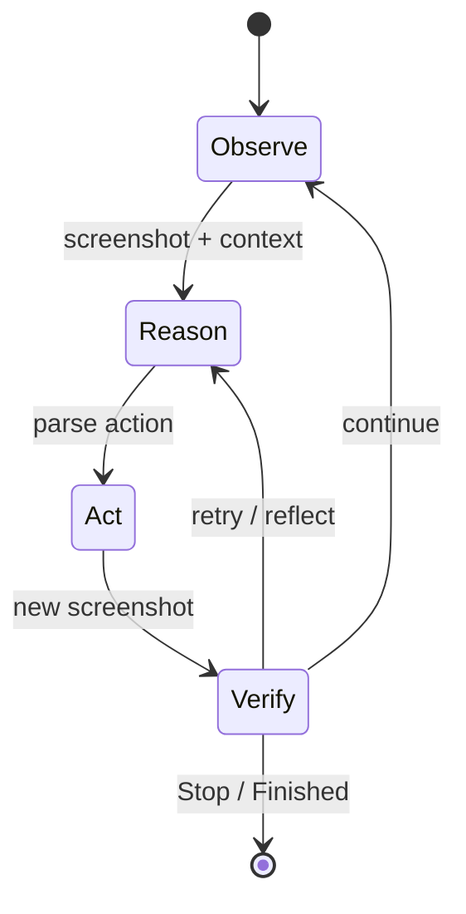

# GUI Agent Loop

Канонический цикл GUI-агента в MobileAgent: **observe screen → reason → act → verify → update state**.

---

## Generic Loop (All Versions)



---

## v1 — Single-Agent Loop

1. Capture screenshot via ADB
2. Run OCR + icon detection → `clickable_infos`
3. Build action prompt with coordinates list
4. LLM returns Thought / Action / Operation
5. Parse action → `controller.py` (tap, swipe, type, …)
6. Repeat until `Stop`

**Characteristics:** Heavy upfront perception; LLM chooses among enumerated coordinates.

---

## v2 — Multi-Prompt Loop

Documented sequence in `Mobile-Agent-v2/run.py`:

1. **Perception** — `get_perception_infos()`
2. **Action agent** — `get_action_prompt()` → execute ADB
3. **Reflection agent** (optional) — before/after screenshots → outcome **A** / **B** / **C**
4. **Memory agent** (optional) — extract storable facts from screen
5. **Progress agent** — update `completed_content` for planning context
6. `error_flag` set on B/C → injected into next action prompt

Switches: `reflection_switch`, `memory_switch` in settings.

---

## v3 — Class-Based Multi-Agent Loop

From `run_mobileagentv3.py` + `mobile_agent_e.py`:

```
┌──────────┐     ┌──────────┐     ┌────────────┐     ┌───────────┐
│ Manager  │ ──► │ Executor │ ──► │ Controller │ ──► │ Reflector │
│ (plan)   │     │ (action) │     │ (ADB/HDC)  │     │ (A/B/C)   │
└──────────┘     └──────────┘     └────────────┘     └─────┬─────┘
      ▲                                                    │
      │         ┌───────────┐                              │
      └──────── │ Notetaker │ ◄── optional ──────────────┘
                │ (notes)   │
                └───────────┘
```

**Manager triggers replan when:** `error_flag_plan` after `err_to_manager_thresh` (default 2) executor failures.

**Executor output:** JSON action dict parsed by `parse_response()` — types include click, long_press, type, swipe, system_button, open_app, answer, terminate.

---

## v3.5 — E2E VLM Loop

`run_gui_owl_1_5_for_mobile.py` collapses orchestration:

1. Screenshot → annotate / resize
2. Single GUI-Owl 1.5 call → action string or structured output
3. `AdbTools` executes
4. Loop until task complete

Multi-agent roles (planner, executor, verifier) described in README as **model capabilities**, not separate Python modules.

---

## OSWorld Variant

`MobileAgentV3.predict()` in `mobile_agent.py`:

- Manager subgoals
- Executor may emit `element_description` → **Grounding** module resolves coordinates
- Actions compiled to **pyautogui Python strings** executed in VM
- Experience JSON (`experience.json`) for RAG-style hints

---

## Terminal Conditions

| Signal | Meaning |
|--------|---------|
| `Stop` / `terminate` | User task deemed complete |
| `answer` action | Explicit Q&A completion step |
| `Finished` in manager | Plan exhausted |
| Max steps / benchmark timeout | Eval harness stop |
| Reflection loop stuck | Risk without circuit breaker (see anti-patterns) |

---

## Contrast with Code-Centric Agent Loop

Claude Code loop: **messages → tool calls → tool results → messages** (text/structured tools, filesystem/shell).

MobileAgent loop: **pixels → coordinates/actions → new pixels** (embodied GUI environment).

Shared abstract pattern: **observe → decide → act → verify → update memory** — but observation modality and action API differ fundamentally.
