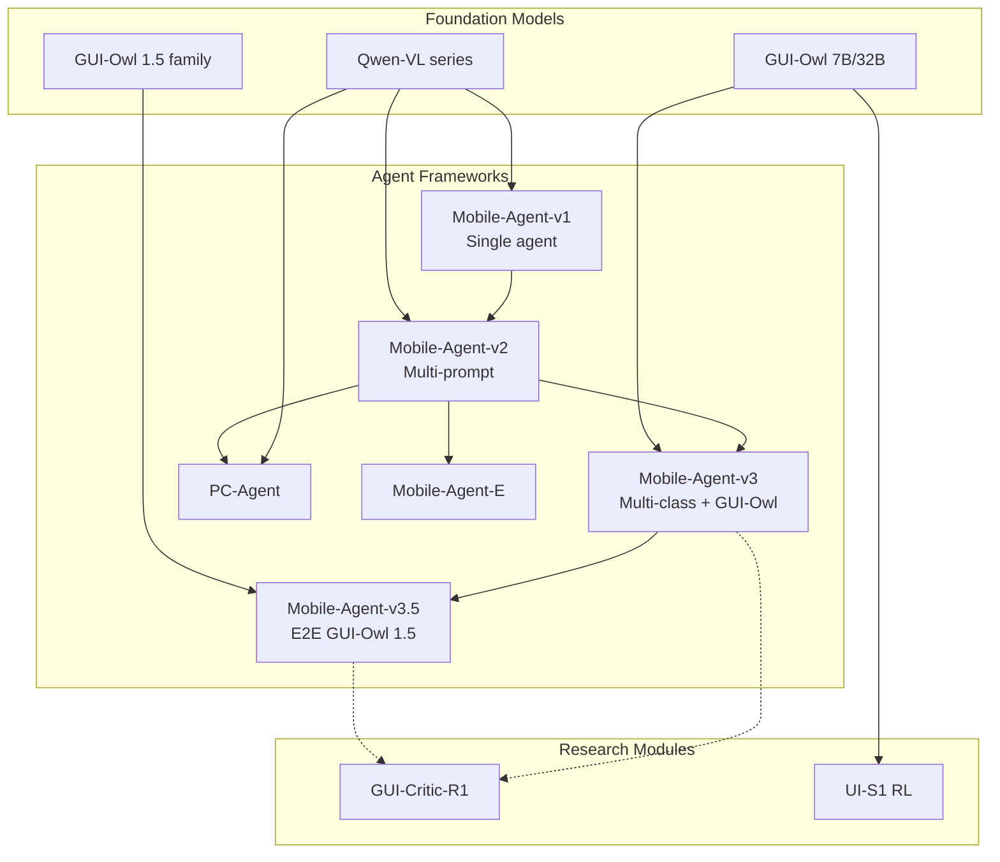

# Mobile-Agent Family — Version Map

---

## Family Tree

---

## Version Cheat Sheet

| Version | Venue | Agent structure | Primary model | Platforms |
|---------|-------|-----------------|---------------|-----------|
| v1 | ICLR 2024 WS | Single operator | GPT-4 + Qwen-VL caption | Android |
| v2 | NeurIPS 2024 | 4 prompt roles | GPT-4o + perception | Android, Harmony |
| v3 | Preprint 2025 | 4 Python agent classes | GUI-Owl + vLLM | Android, OSWorld eval |
| v3.5 | Preprint 2026 | E2E VLM (+ model roles) | GUI-Owl 1.5 | Mobile, PC, browser |
| PC-Agent | ICLR 2025 WS | 5 prompt roles | Qwen-VL | Windows/Mac desktop |
| Mobile-Agent-E | Preprint 2025 | Multi + experience | Qwen + perception | Android |
| GUI-Critic-R1 | NeurIPS 2025 | Offline critic | Qwen2.5-VL | Mobile/desktop/web datasets |
| UI-S1 | ACL 2026 | RL training | Qwen GUI + VERL | Training envs |

---

## Capability Progression

### Navigation & planning
- **v1:** Implicit in single-thread reasoning
- **v2:** Progress agent tracks `completed_content`
- **v3:** Manager maintains plan + subgoals + replan on stuck
- **v3.5:** Native long-horizon memory in model; MemGUI-Bench leader claim

### Visual grounding
- **v1/v2:** External OCR + DINO + coordinate lists in prompt
- **v3:** GUI-Owl end-to-end + optional Grounding module (OSWorld)
- **v3.5:** Native grounding benchmarks (ScreenSpot, OSWorld-G)

### Tool use / MCP
- **v1–v3:** GUI actions only in open-source loops
- **v3.5:** Native tool & MCP calling (OSWorld-MCP, Mobile-World SOTA claims)

### Self-improvement
- **Mobile-Agent-E:** Experience reflector/retriever for shortcuts and tips
- **UI-S1:** Semi-online RL for policy improvement (training, not runtime)

### Error diagnosis
- **v2+:** Post-action reflection (A/B/C)
- **GUI-Critic-R1:** Pre-action critic (not integrated in main loops)

---

## Which Version to Study for What

| Research question | Best starting point |
|-------------------|---------------------|
| GUI as environment + ADB contract | v2 `run.py` + `prompt.py` |
| Multi-agent coordination + InfoPool | v3 `mobile_agent_e.py` |
| Native VLM GUI agent | v3.5 `mobile_use/utils.py` |
| Desktop automation | PC-Agent `run.py` |
| Benchmark integration | v3 `os_world_v3/`, `android_world_v3/` |
| Action verification theory | GUI-Critic-R1 + v2 reflect prompts |
| Training GUI policies | UI-S1 |

---

## External Ecosystem

- **ToolCUA** (separate repo) — GUI vs tool path orchestration
- **OSWorld-MCP** — MCP benchmark
- **MobileWorld** — mobile tool+MCP benchmark
- **Wuying Cloud Phone/Desktop** — hosted demos without local deploy

---

## Research Workspace Note

Only `source/MobileAgent/` is cloned. Related repos (ToolCUA, OSWorld-MCP, MobileWorld) are referenced in README but **not ingested** in this experiment.
