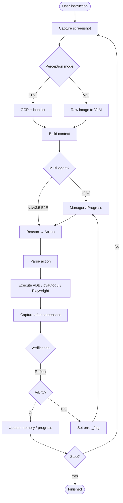

# GUI Agent Loop — Diagram

## Legend

- **A** — success, continue
- **B** — wrong page, often back
- **C** — no change, retry

## Version Notes

- v2: Plan box = Progress agent output, not Manager class
- v3.5 mobile: Plan/Reflect boxes often collapsed into single VLM
- GUI-Critic pre-check not shown (optional pre-op path)
