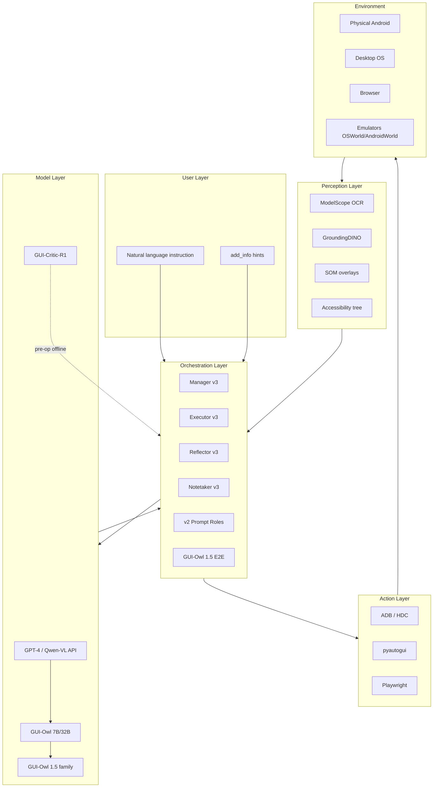

# MobileAgent System Map — Diagram

## Subproject Mapping

| Box | Repo path |
|-----|-----------|
| v2 Prompt Roles | `Mobile-Agent-v2/` |
| MA3 classes | `Mobile-Agent-v3/mobile_v3/` |
| GUI-Owl 1.5 | `Mobile-Agent-v3.5/` |
| OCR/DINO | v1/v2/E/PC |
| Benchmarks | `os_world_v3/`, `android_world_v3*`, `web_benchmark/` |
| GUI-Critic | `GUI-Critic-R1/` |
| UI-S1 training | `UI-S1/` (dashed — not runtime) |
