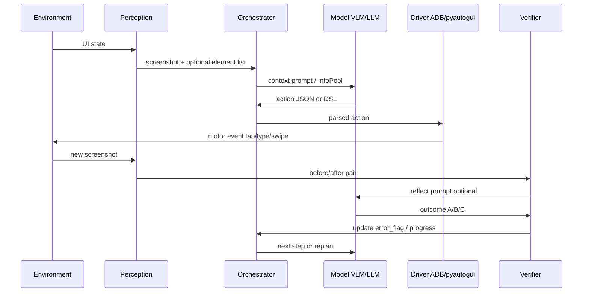
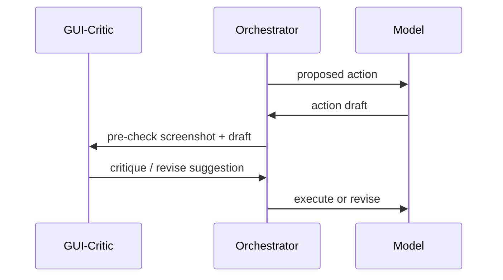

# Perception → Action → Feedback — Diagram

## Data Artifacts per Step

| Stage | Artifact |
|-------|----------|
| Perception | PNG screenshot, clickable_infos[] |
| Reason | Thought, Plan, Action JSON |
| Execute | ADB shell commands |
| Feedback | action_outcomes[], new PNG |
| Memory | important_notes, memory string |

## v3.5 Simplified Path

Verifier may be implicit — model observes new screenshot in next turn without separate Reflector class call.

## Extension: Pre-Op Critic

Not implemented in production loops — research direction only.
