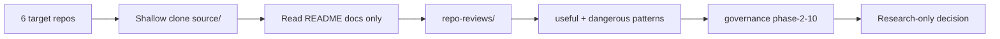

# Repo Triage Flow

```mermaid
flowchart LR
    LIST[6 target repos]
    CLONE[Shallow clone source/]
    READ[Read README docs only]
    REVIEW[repo-reviews/]
    PAT[useful + dangerous patterns]
    GOV[governance phase-2-10]
    DEC[Research-only decision]
    LIST --> CLONE --> READ --> REVIEW --> PAT --> GOV --> DEC
```

No install. No run.
