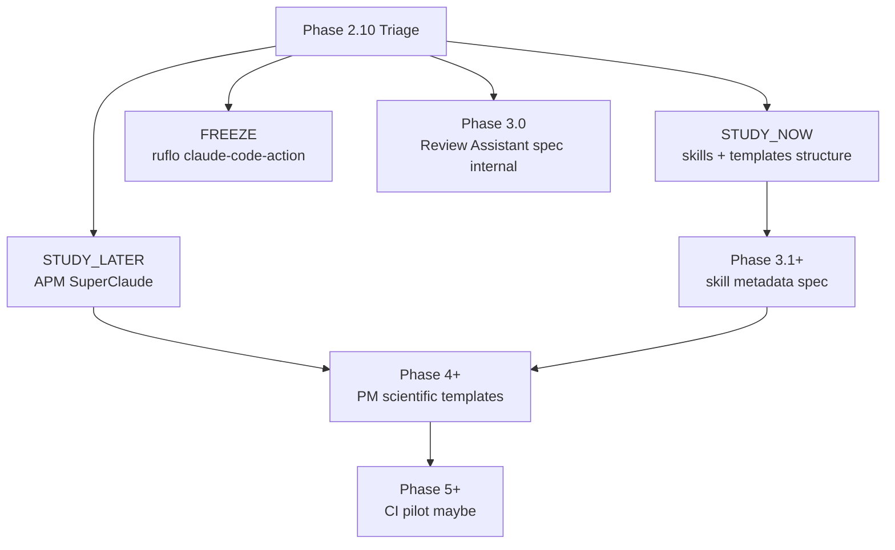

# Research to Future Backlog

```mermaid
flowchart TD
    TRI[Phase 2.10 Triage]
    NOW[STUDY_NOW\nskills + templates structure]
    LATER[STUDY_LATER\nAPM SuperClaude]
    FREEZE[FREEZE\nruflo claude-code-action]
    P30[Phase 3.0\nReview Assistant spec internal]
    P31[Phase 3.1+\nskill metadata spec]
    P4[Phase 4+\nPM scientific templates]
    P5[Phase 5+\nCI pilot maybe]
    TRI --> NOW --> P31
    TRI --> LATER --> P4
    TRI --> FREEZE
    TRI --> P30
    P31 --> P4
    P4 --> P5
```
