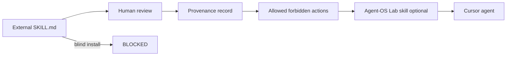

# Skill Security Boundary

```mermaid
flowchart LR
    SKILL[External SKILL.md]
    REVIEW[Human review]
    PROV[Provenance record]
    BOUND[Allowed forbidden actions]
    LAB[Agent-OS Lab skill optional]
    AGENT[Cursor agent]
    SKILL --> REVIEW --> PROV --> BOUND --> LAB --> AGENT
    SKILL -->|blind install| X[BLOCKED]
```

Phase 2.10: all external skills stay in triage quarantine.
