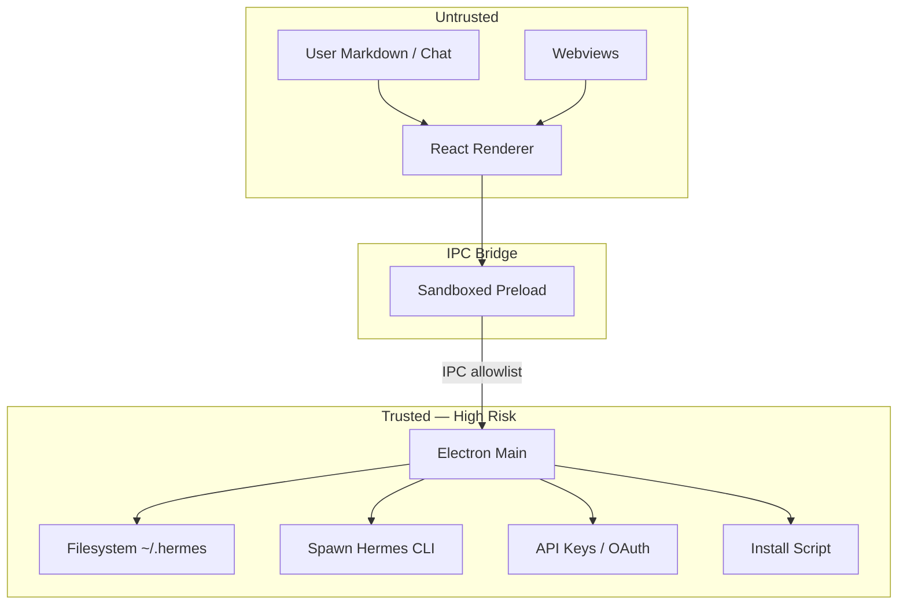

# Desktop Security Boundary

**Hermes mitigations (observed):** contextIsolation, sandbox, navigation allowlists.

**Agent-OS stance:** defer Electron until checklist satisfied; prefer read-only console MVP.
