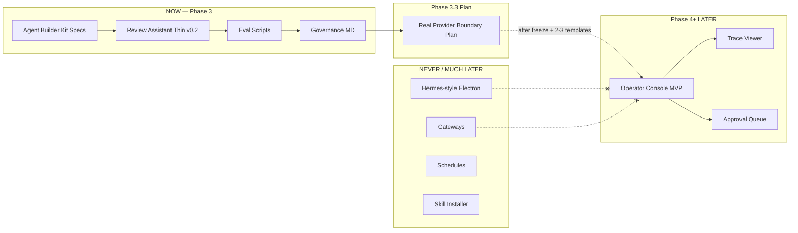

# Future Operator Console Boundary

```mermaid
flowchart LR
  subgraph Now["NOW — Phase 3"]
    Specs[Agent Builder Kit Specs]
    Thin[Review Assistant Thin v0.2]
    Eval[Eval Scripts]
    Gov[Governance MD]
  end

  subgraph Plan["Phase 3.3 Plan"]
    ProviderPlan[Real Provider Boundary Plan]
  end

  subgraph Later["Phase 4+ LATER"]
    Console[Operator Console MVP]
    TraceView[Trace Viewer]
    ApprovalQ[Approval Queue]
  end

  subgraph Never["NEVER / MUCH LATER"]
    Electron[Hermes-style Electron]
    Gateways[Gateways]
    Schedules[Schedules]
    SkillInstall[Skill Installer]
  end

  Specs --> Thin
  Thin --> Eval
  Eval --> Gov
  Gov --> ProviderPlan
  ProviderPlan -.->|"after freeze + 2-3 templates"| Console
  Console --> TraceView
  Console --> ApprovalQ
  Electron -.-x Console
  Gateways -.-x Console
```

Solid = current path. Dotted = future allowed. X = not our console model.
