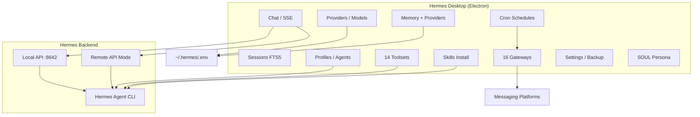

# Hermes Desktop Surface Map

```mermaid
flowchart TB
  subgraph Desktop["Hermes Desktop (Electron)"]
    Chat[Chat / SSE]
    Sessions[Sessions FTS5]
    Profiles[Profiles / Agents]
    Memory[Memory + Providers]
    Skills[Skills Install]
    Tools[14 Toolsets]
    Schedules[Cron Schedules]
    Gateway[16 Gateways]
    Providers[Providers / Models]
    Settings[Settings / Backup]
    Persona[SOUL Persona]
  end

  subgraph Backend["Hermes Backend"]
    Local[Local API :8642]
    Remote[Remote API Mode]
    HermesAgent[Hermes Agent CLI]
  end

  Chat --> Local
  Chat --> Remote
  Local --> HermesAgent
  Remote --> HermesAgent
  Profiles --> HermesAgent
  Tools --> HermesAgent
  Skills --> HermesAgent
  Schedules --> Gateway
  Gateway --> External[Messaging Platforms]
  Providers --> Env["~/.hermes/.env"]
  Memory --> Env
```

**Agent-OS mapping:** study Chat/Sessions/Providers as **future console hints**; treat Tools/Skills/Schedules/Gateway as **out of scope**.
