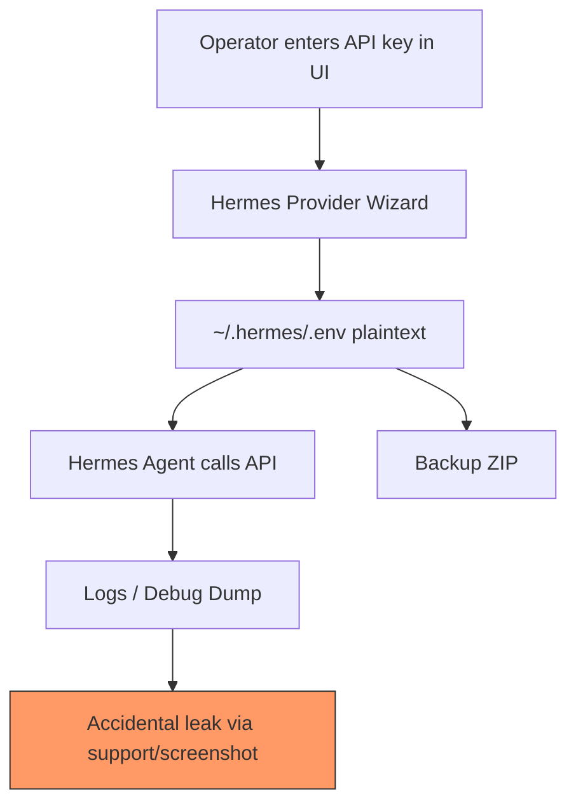
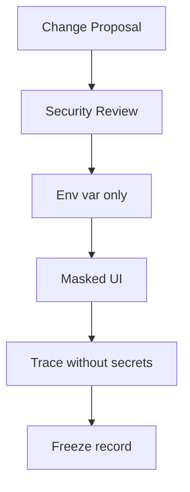

# Provider Config Risk Flow

```mermaid
flowchart TD
  User[Operator enters API key in UI]
  UI[Hermes Provider Wizard]
  Env["~/.hermes/.env plaintext"]
  Agent[Hermes Agent calls API]
  Log[Logs / Debug Dump]
  Backup[Backup ZIP]

  User --> UI
  UI --> Env
  Env --> Agent
  Env --> Backup
  Agent --> Log
  Log --> Leak[Accidental leak via support/screenshot]

  style Leak fill:#f96,stroke:#333
```

**Agent-OS mitigation path (future):**

```mermaid
flowchart TD
  P[Change Proposal] --> S[Security Review]
  S --> E[Env var only]
  E --> M[Masked UI]
  M --> T[Trace without secrets]
  T --> F[Freeze record]
```

Phase 3: mock only — no key flow.
