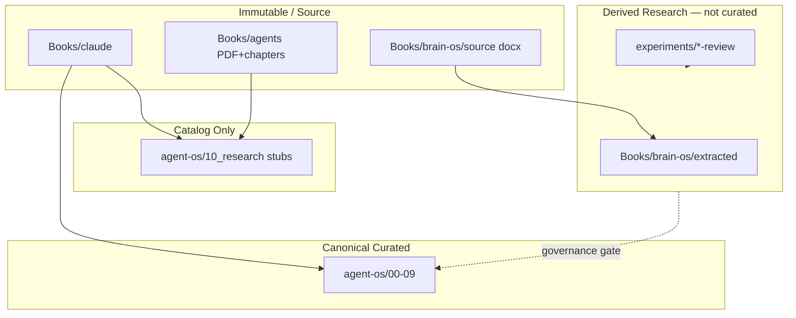

# Canonical vs Research Layers

```mermaid
flowchart TB
    subgraph immutable["Immutable / Source"]
        B1[Books/claude]
        B2[Books/agents PDF+chapters]
        B3[Books/brain-os/source docx]
    end
    subgraph derived["Derived Research — not curated"]
        BR[Books/brain-os/extracted]
        EX[experiments/*-review]
    end
    subgraph curated["Canonical Curated"]
        AO[agent-os/00-09]
    end
    subgraph catalog["Catalog Only"]
        R10[agent-os/10_research stubs]
    end
    B1 --> AO
    B1 --> R10
    B2 --> R10
    B3 --> BR
    EX --> derived
    derived -.->|governance gate| AO
```
