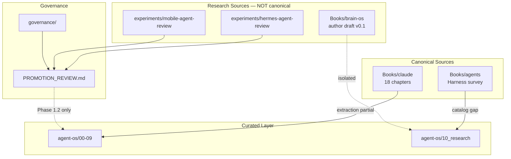

# Corpus Relationships

```mermaid
flowchart TB
    subgraph canonical["Canonical Sources"]
        CL[Books/claude<br/>18 chapters]
        HA[Books/agents<br/>Harness survey]
    end
    subgraph research["Research Sources — NOT canonical"]
        BO[Books/brain-os<br/>author draft v0.1]
        EH[experiments/hermes-agent-review]
        EM[experiments/mobile-agent-review]
    end
    subgraph curated["Curated Layer"]
        AO[agent-os/00-09]
        R10[agent-os/10_research]
    end
    subgraph gov["Governance"]
        GV[governance/]
        PR[PROMOTION_REVIEW.md]
    end
    CL -->|extraction partial| AO
    HA -->|catalog gap| R10
    BO -.->|isolated| R10
    EH --> PR
    EM --> PR
    PR -.->|Phase 1.2 only| AO
    GV --> PR
```
