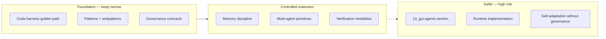

# Future Architecture Direction

```mermaid
flowchart LR
    subgraph foundation["Foundation — keep narrow"]
        HP[Code harness golden path]
        PAT[Patterns + antipatterns]
        GOV[Governance contracts]
    end
    subgraph extend["Controlled extension"]
        MEM[Memory discipline]
        MA[Multi-agent primitives]
        VER[Verification modalities]
    end
    subgraph defer["Defer — high risk"]
        GUI[13_gui-agents section]
        RT[Runtime implementation]
        ADAPT[Self-adaptation without governance]
    end
    foundation --> extend
    extend -.-> defer
```
