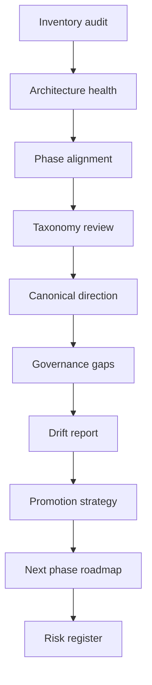

# Governance Pipeline

```mermaid
flowchart TD
    INV[Inventory audit] --> HEALTH[Architecture health]
    HEALTH --> PHASE[Phase alignment]
    PHASE --> TAX[Taxonomy review]
    TAX --> CANON[Canonical direction]
    CANON --> GAP[Governance gaps]
    GAP --> DRIFT[Drift report]
    DRIFT --> STRAT[Promotion strategy]
    STRAT --> ROAD[Next phase roadmap]
    ROAD --> RISK[Risk register]
```
