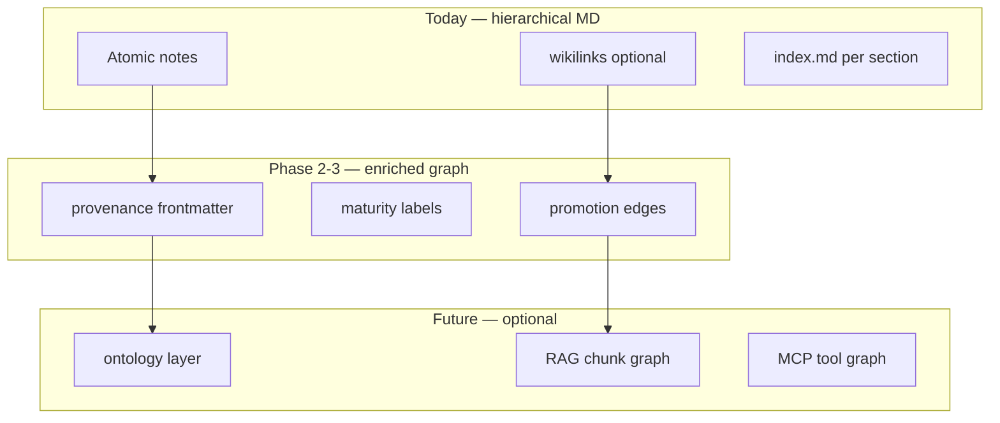

# Knowledge Graph Direction

```mermaid
flowchart TB
    subgraph today["Today — hierarchical MD"]
        MD[Atomic notes]
        WL[wikilinks optional]
        IDX[index.md per section]
    end
    subgraph next["Phase 2-3 — enriched graph"]
        PROV[provenance frontmatter]
        MAT[maturity labels]
        PROM[promotion edges]
    end
    subgraph future["Future — optional"]
        ONTO[ontology layer]
        RAG[RAG chunk graph]
        MCPG[MCP tool graph]
    end
    MD --> PROV
    WL --> PROM
    PROV --> ONTO
    PROM --> RAG
```
