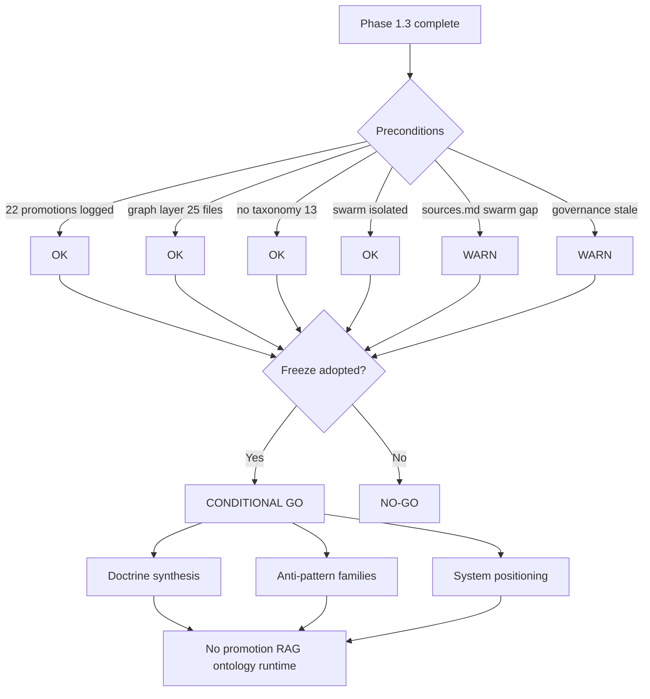

# Phase 1.4 Readiness

```mermaid
flowchart TD
    START[Phase 1.3 complete] --> PRE{Preconditions}
    PRE -->|22 promotions logged| P1[OK]
    PRE -->|graph layer 25 files| P2[OK]
    PRE -->|no taxonomy 13| P3[OK]
    PRE -->|swarm isolated| P4[OK]
    PRE -->|sources.md swarm gap| P5[WARN]
    PRE -->|governance stale| P6[WARN]

    P1 --> GATE
    P2 --> GATE
    P3 --> GATE
    P4 --> GATE
    P5 --> GATE
    P6 --> GATE

    GATE{Freeze adopted?}
    GATE -->|Yes| DECISION[CONDITIONAL GO]
    GATE -->|No| NOGO[NO-GO]

    DECISION --> S1[Doctrine synthesis]
    DECISION --> S2[Anti-pattern families]
    DECISION --> S3[System positioning]

    S1 --> FORBID[No promotion RAG ontology runtime]
    S2 --> FORBID
    S3 --> FORBID
```

## Up

- [PHASE_1_4_READINESS.md](../PHASE_1_4_READINESS.md)
- [FREEZE_RECOMMENDATIONS.md](../FREEZE_RECOMMENDATIONS.md)
