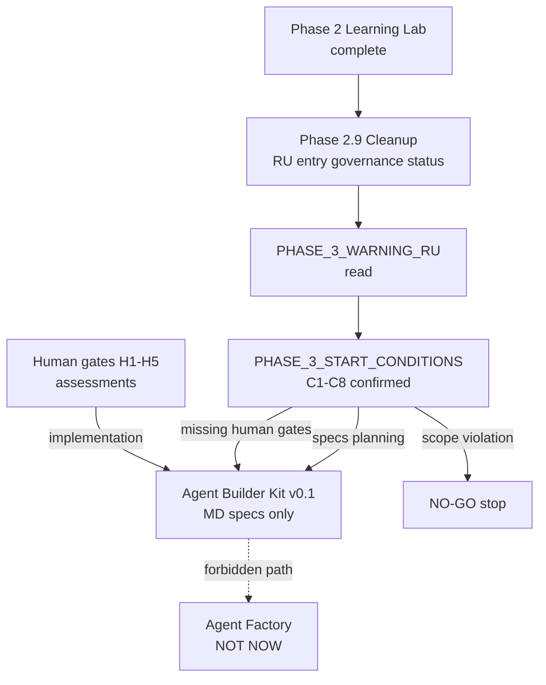

# Phase 2 → Phase 3 Clean Gate

```mermaid
flowchart TD
    P2[Phase 2 Learning Lab\ncomplete]
    C29[Phase 2.9 Cleanup\nRU entry governance status]
    WARN[PHASE_3_WARNING_RU\nread]
    COND[PHASE_3_START_CONDITIONS\nC1-C8 confirmed]
    HUM[Human gates H1-H5\nassessments]
    KIT[Agent Builder Kit v0.1\nMD specs only]
    FACTORY[Agent Factory\nNOT NOW]
    P2 --> C29 --> WARN --> COND
    COND -->|specs planning| KIT
    COND -->|missing human gates| KIT
    HUM -->|implementation| KIT
    KIT -.->|forbidden path| FACTORY
    COND -->|scope violation| STOP[NO-GO stop]
```

Phase 2.9 adds cleanup **before** kit — does not create kit folder.
