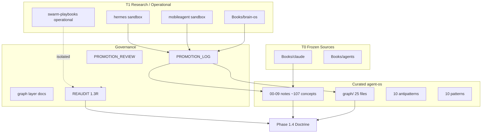

# System State After Phase 1.3

```mermaid
flowchart TB
    subgraph frozen [T0 Frozen Sources]
        CL[Books/claude]
        AG[Books/agents]
    end

    subgraph research [T1 Research / Operational]
        BO[Books/brain-os]
        HE[hermes sandbox]
        MA[mobileagent sandbox]
        SW[swarm-playbooks operational]
    end

    subgraph gov [Governance]
        PR[PROMOTION_REVIEW]
        PL[PROMOTION_LOG]
        GR[graph layer docs]
        RE[REAUDIT 1.3R]
    end

    subgraph curated [Curated agent-os]
        AO[00-09 notes ~107 concepts]
        G[graph/ 25 files]
        AP[10 antipatterns]
        PAT[10 patterns]
    end

    CL --> AO
    HE --> PL
    MA --> PL
    BO --> PL
    PL --> AO
    PL --> G
    SW -. isolated .-> RE
    gov --> RE
    RE --> Phase14[Phase 1.4 Doctrine]
    AO --> Phase14
    G --> Phase14
```

## Up

- [SYSTEM_STATE_AFTER_1_3.md](../SYSTEM_STATE_AFTER_1_3.md)
