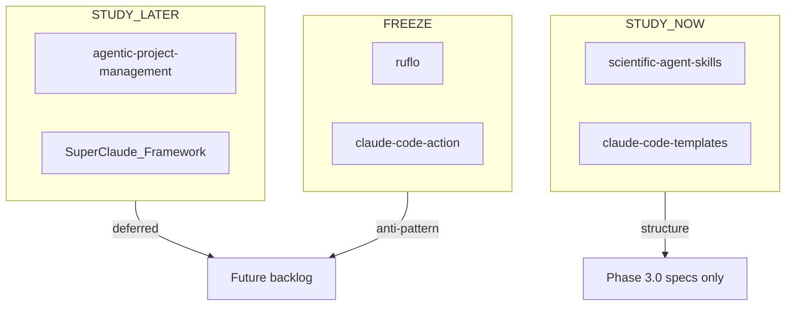

# External Repos Decision Map

```mermaid
flowchart TD
    subgraph study_now [STUDY_NOW]
        SAS[scientific-agent-skills]
        CCT[claude-code-templates]
    end
    subgraph study_later [STUDY_LATER]
        APM[agentic-project-management]
        SC[SuperClaude_Framework]
    end
    subgraph freeze [FREEZE]
        RUF[ruflo]
        CCA[claude-code-action]
    end
    P3[Phase 3.0 specs only]
    study_now -->|structure| P3
    study_later -->|deferred| FB[Future backlog]
    freeze -->|anti-pattern| FB
```
