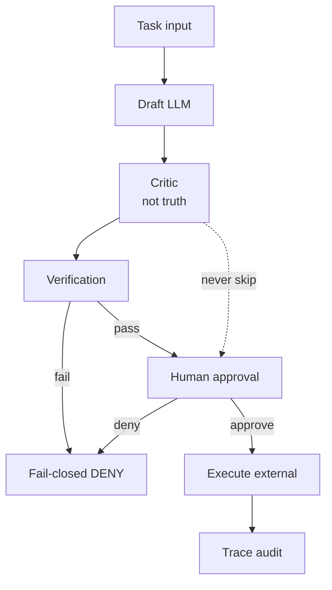

# Agent Template Safety Boundary

```mermaid
flowchart TD
    T[Task input]
    D[Draft LLM]
    C[Critic\nnot truth]
    V[Verification]
    H[Human approval]
    X[Execute external]
    TR[Trace audit]
    T --> D --> C --> V
    V -->|fail| DENY[Fail-closed DENY]
    V -->|pass| H
    H -->|deny| DENY
    H -->|approve| X --> TR
    C -.->|never skip| H
```

Template must document each box and deny paths.
