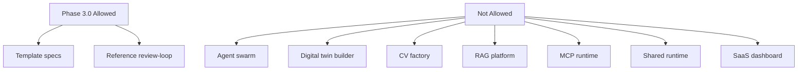

# Do Not Build Yet

```mermaid
flowchart TB
    P3[Phase 3.0 Allowed]
    P3 --> SPEC[Template specs]
    P3 --> REF[Reference review-loop]
    NB[Not Allowed]
    NB --> SWARM[Agent swarm]
    NB --> DT[Digital twin builder]
    NB --> CV[CV factory]
    NB --> RAG[RAG platform]
    NB --> MCP[MCP runtime]
    NB --> RT[Shared runtime]
    NB --> SAAS[SaaS dashboard]
```
