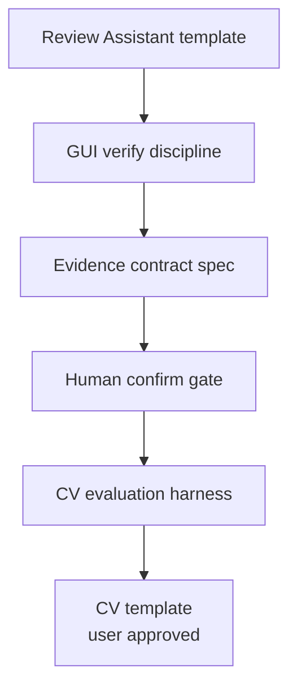

# Future CV Agent Path

```mermaid
flowchart TD
    RA[Review Assistant template]
    GV[GUI verify discipline]
    EV[Evidence contract spec]
    HC[Human confirm gate]
    EVAL[CV evaluation harness]
    CV[CV template\nuser approved]
    RA --> GV --> EV --> HC --> EVAL --> CV
```

Phase 3.0: only RA + GV teaching — no CV node build.
