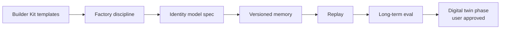

# Future Digital Twin Path

```mermaid
flowchart LR
    KIT[Builder Kit templates]
    F1[Factory discipline]
    ID[Identity model spec]
    MEM[Versioned memory]
    REP[Replay]
    EVAL[Long-term eval]
    DT[Digital twin phase\nuser approved]
    KIT --> F1 --> ID --> MEM --> REP --> EVAL --> DT
```

Phase 3.0 stops at KIT — no DT box implementation.
