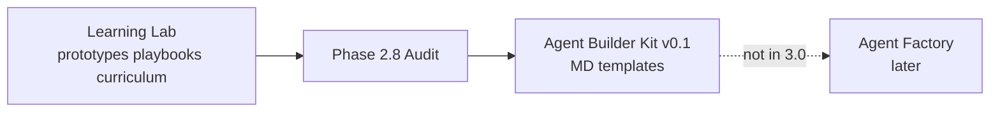

# Learning Lab → Builder Kit

```mermaid
flowchart LR
    LAB[Learning Lab\nprototypes playbooks curriculum]
    AUD[Phase 2.8 Audit]
    KIT[Agent Builder Kit v0.1\nMD templates]
    FACTORY[Agent Factory\nlater]
    LAB --> AUD --> KIT
    KIT -.->|not in 3.0| FACTORY
```
