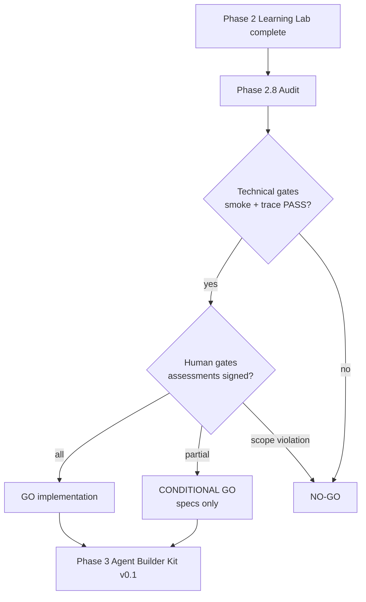

# Phase 2 → Phase 3 Gate

```mermaid
flowchart TD
    P2[Phase 2 Learning Lab complete]
    AUD[Phase 2.8 Audit]
    TECH{Technical gates\nsmoke + trace PASS?}
    HUM{Human gates\nassessments signed?}
    COND[CONDITIONAL GO\nspecs only]
    FULL[GO implementation]
    NOGO[NO-GO]
    P3[Phase 3 Agent Builder Kit v0.1]
    P2 --> AUD --> TECH
    TECH -->|no| NOGO
    TECH -->|yes| HUM
    HUM -->|partial| COND --> P3
    HUM -->|all| FULL --> P3
    HUM -->|scope violation| NOGO
```
