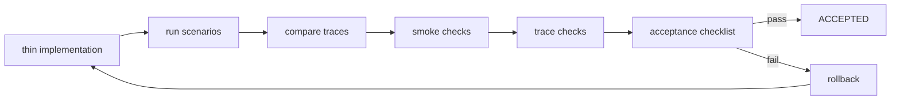

# Evaluation Loop (Phase 3.1)

```mermaid
flowchart LR
  IMPL[thin implementation] --> SC[run scenarios]
  SC --> TR[compare traces]
  TR --> SM[smoke checks]
  SM --> TC[trace checks]
  TC --> CHK[acceptance checklist]
  CHK -->|pass| ACC[ACCEPTED]
  CHK -->|fail| RB[rollback]
  RB --> IMPL
```

Reference: [EVALUATION_PLAN.md](../EVALUATION_PLAN.md), [POST_IMPLEMENTATION_CHECKLIST.md](../POST_IMPLEMENTATION_CHECKLIST.md)
