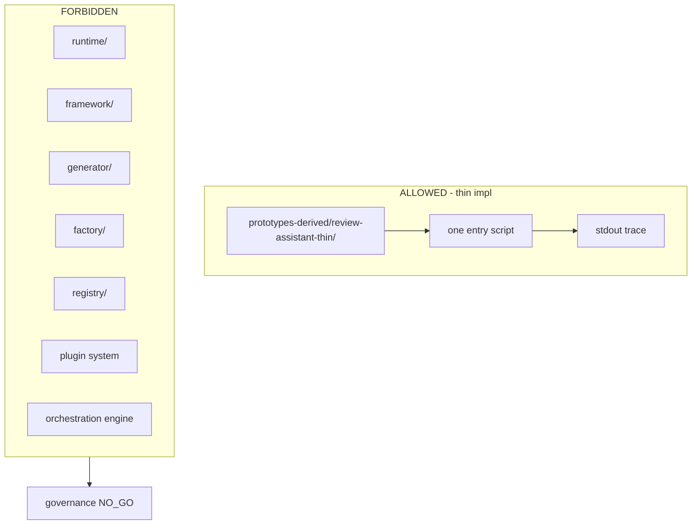

# No Runtime Boundary (Phase 3.1)

```mermaid
flowchart TB
  subgraph ok [ALLOWED - thin impl]
    FOLDER[prototypes-derived/review-assistant-thin/]
    SCRIPT[one entry script]
    STDOUT[stdout trace]
  end

  subgraph no [FORBIDDEN]
    RT[runtime/]
    FW[framework/]
    GEN[generator/]
    FAC[factory/]
    REG[registry/]
    PLG[plugin system]
    ENG[orchestration engine]
  end

  FOLDER --> SCRIPT --> STDOUT
  no --> STOP[governance NO_GO]
```

Reference: [NO_RUNTIME_DECISION.md](../NO_RUNTIME_DECISION.md)
