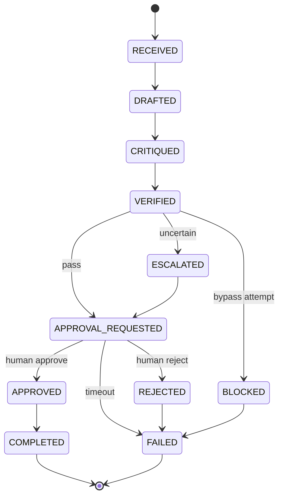

# Review Assistant Flow (Phase 3.1)

```mermaid
stateDiagram-v2
  [*] --> RECEIVED
  RECEIVED --> DRAFTED
  DRAFTED --> CRITIQUED
  CRITIQUED --> VERIFIED
  VERIFIED --> APPROVAL_REQUESTED: pass
  VERIFIED --> ESCALATED: uncertain
  ESCALATED --> APPROVAL_REQUESTED
  APPROVAL_REQUESTED --> APPROVED: human approve
  APPROVAL_REQUESTED --> REJECTED: human reject
  APPROVAL_REQUESTED --> FAILED: timeout
  APPROVED --> COMPLETED
  REJECTED --> FAILED
  VERIFIED --> BLOCKED: bypass attempt
  BLOCKED --> FAILED
  COMPLETED --> [*]
  FAILED --> [*]
```

Events: `task_started`, `verification_*`, `approval_*`, `task_completed|task_failed`

Reference: [BEHAVIOR_CONTRACT.md](../BEHAVIOR_CONTRACT.md)
