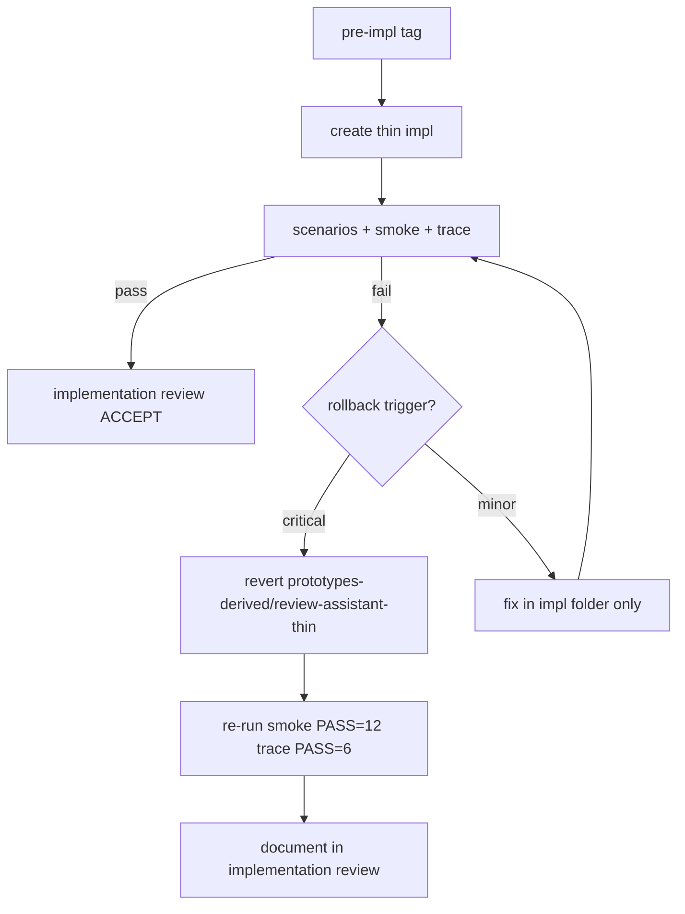

# Rollback Flow (Phase 3.1)

```mermaid
flowchart TD
  START[pre-impl tag] --> CODE[create thin impl]
  CODE --> TEST[scenarios + smoke + trace]
  TEST -->|pass| DONE[implementation review ACCEPT]
  TEST -->|fail| SIG{rollback trigger?}
  SIG -->|critical| REV[revert prototypes-derived/review-assistant-thin]
  REV --> BASE[re-run smoke PASS=12 trace PASS=6]
  BASE --> DOC[document in implementation review]
  SIG -->|minor| FIX[fix in impl folder only]
  FIX --> TEST
```

**Never** patch frozen spec or protected folders to fix impl.

Reference: [ROLLBACK_PLAN.md](../ROLLBACK_PLAN.md)
