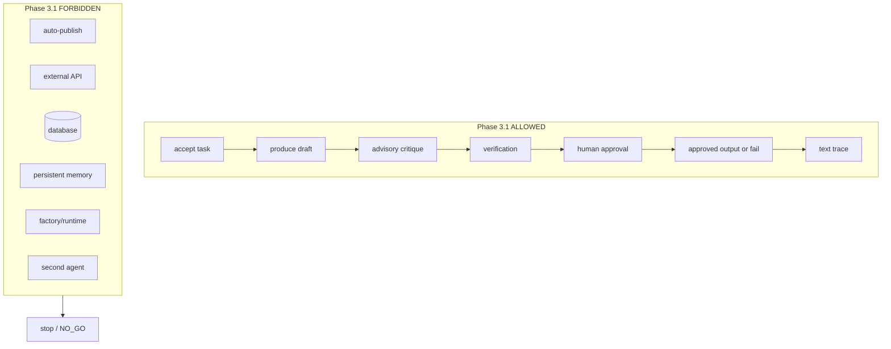

# Thin Implementation Boundary

```mermaid
flowchart TB
  subgraph allowed [Phase 3.1 ALLOWED]
    TASK[accept task]
    DRAFT[produce draft]
    CRIT[advisory critique]
    VER[verification]
    APP[human approval]
    OUT[approved output or fail]
    TRACE[text trace]
  end

  subgraph forbidden [Phase 3.1 FORBIDDEN]
    AUTO[auto-publish]
    API[external API]
    DB[(database)]
    MEM[persistent memory]
    FAC[factory/runtime]
    AG2[second agent]
  end

  TASK --> DRAFT --> CRIT --> VER --> APP --> OUT --> TRACE
  forbidden --> BLOCK[stop / NO_GO]
```

Reference: [IMPLEMENTATION_SCOPE.md](../IMPLEMENTATION_SCOPE.md)
