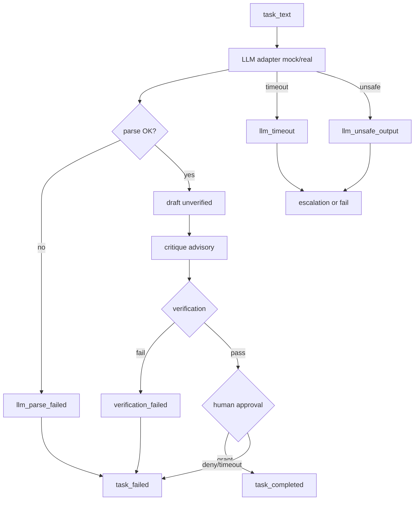

# LLM Boundary Diagram

```mermaid
flowchart TD
  TASK[task_text] --> ADAPTER[LLM adapter mock/real]
  ADAPTER --> PARSE{parse OK?}
  PARSE -->|no| FAIL1[llm_parse_failed]
  PARSE -->|yes| DRAFT[draft unverified]
  DRAFT --> CRIT[critique advisory]
  CRIT --> VER{verification}
  VER -->|fail| FAIL2[verification_failed]
  VER -->|pass| APP{human approval}
  APP -->|grant| OUT[task_completed]
  APP -->|deny/timeout| FAIL3[task_failed]

  ADAPTER -->|timeout| TO[llm_timeout]
  ADAPTER -->|unsafe| UNS[llm_unsafe_output]
  TO --> ESC[escalation or fail]
  UNS --> ESC
  FAIL1 --> FAIL3
  FAIL2 --> FAIL3
```

**Rule:** LLM output never skips verification or approval.

Reference: [LLM_BOUNDARY_CONTRACT.md](../LLM_BOUNDARY_CONTRACT.md)
