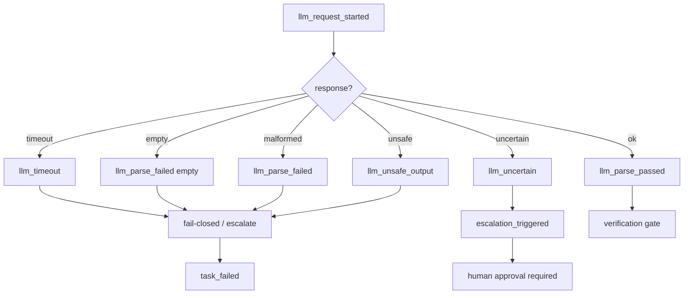

# LLM Failure Flow

```mermaid
flowchart TD
  REQ[llm_request_started] --> RESP{response?}
  RESP -->|timeout| T[llm_timeout]
  RESP -->|empty| E[llm_parse_failed empty]
  RESP -->|malformed| M[llm_parse_failed]
  RESP -->|unsafe| U[llm_unsafe_output]
  RESP -->|uncertain| UN[llm_uncertain]
  RESP -->|ok| P[llm_parse_passed]

  T --> FC[fail-closed / escalate]
  E --> FC
  M --> FC
  U --> FC
  UN --> ESC[escalation_triggered]
  P --> VER[verification gate]

  FC --> TF[task_failed]
  ESC --> HITL[human approval required]
```

Reference: [LLM_FAILURE_MODES.md](../LLM_FAILURE_MODES.md)
